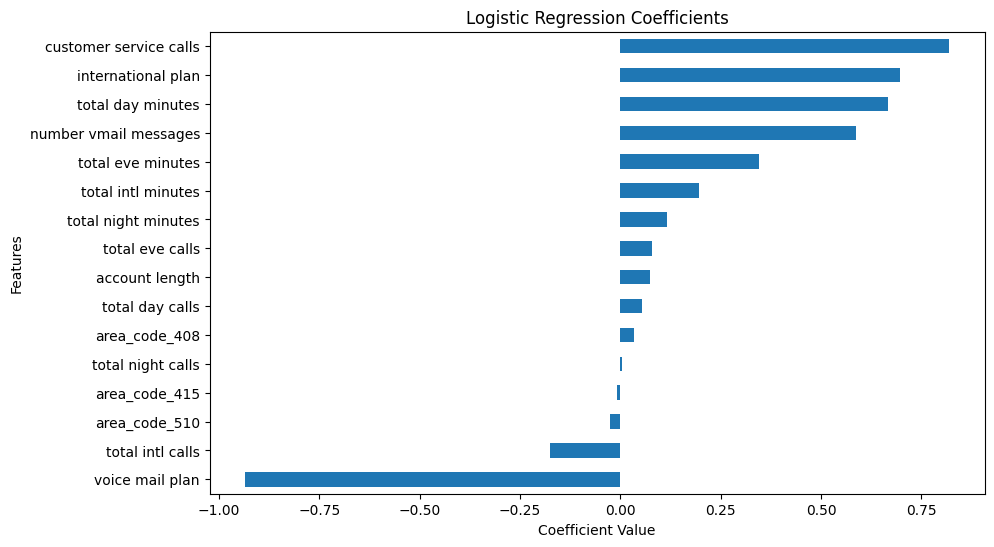
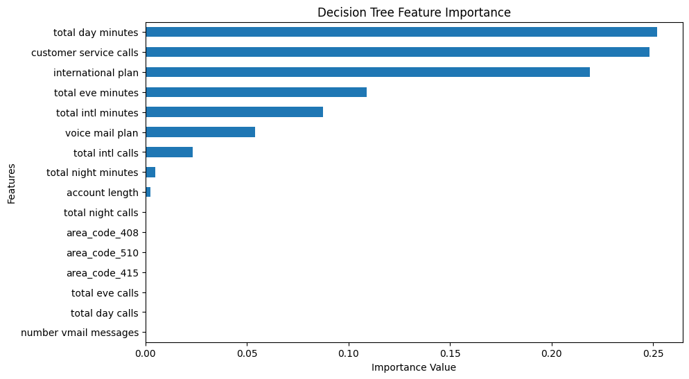
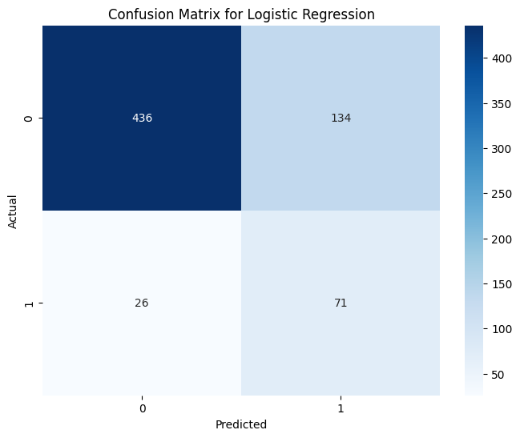
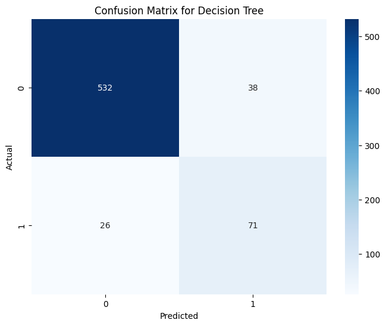

# SyriaTel Clients Churn Analysis

## Project Overview

SyriaTel Communications is a communication company that is looking to predict and prevent customer churn.

Customer churn is when a customer consuming SyriaTel Services. Customer churn is a major problem for many service-based companies because it is so expensive as the company lose the customers, but they also incur a customer acquisition cost to replace that customer.

For SyriaTel fix the problem, we first have to  conducted an Exploratory Data Analysis and  built a machine learning classifier that will predict the customers that are going to churn.

### Business Understanding

- The goal is to predict whether a customer will "soon" stop doing business with SyriaTel, a telecommunications company, in order to reduce revenue loss due to customer churn.
  
- This is a binary classification problem where the target variable is "churn" is True for customers who leave, False for those who stay.
  
#### Business Context

- Customer churn is a critical issue for telecom companies like SyriaTel, as retaining existing customers is often more cost-effective than acquiring new ones.
  
- Losing customers leads to lost revenue, reduced market share, and increased costs for marketing and customer acquisition.
  
- By identifying customers at risk of churning, SyriaTel can implement targeted retention strategies, such as offering discounts, personalized plans, or improved customer service, to keep these customers.

##### Key Business Questions

- Are there specific customer behaviors or account characteristics that predict churn?
- Can we build a reliable model to identify at-risk customers early enough to intervene?
- Which factors are most influential in driving churn, and how can the business address them?

##### Success Metrics

From a business perspective, success will be measured by:

- The ability to accurately predict churn **(Recall)**, enabling proactive retention efforts.

- Reduction in churn rate after implementing strategies based on model insights.
- Cost savings from retaining customers compared to acquiring new ones.

##### Expected Outcomes / Objectives

By leveraging predictive modeling (using Logistic Regression and Decision Tree classifiers), SyriaTel can:

- Identify key predictors of churn e.g high customer service calls, voice mail plans.
- Develop targeted retention programs to reduce churn rates.
- Optimize resource allocation by focusing on high-risk customers.
  
### Data Understanding and Preparation

#### Data Source and Overview

- The dataset is sourced from: [https://www.kaggle.com/datasets/becksddf/churn-in-telecoms-dataset/data](https://www.kaggle.com/datasets/becksddf/churn-in-telecoms-dataset/data). The data has information SyriaTel customers and how the interact with SyriaTel services.
- **Size**: The dataset contains 3,333 rows (customers) and 21 columns (features, including the target variable).
  
- **Target Variable**: `churn` which is `True` for customers who left, `False` for those who stayed.
  
- **Features**: The dataset includes a mix of numerical and categorical features related to customer demographics, account details, usage patterns, and interactions with customer service.

### Modeling

- We build and train two classifiers, **Logistic Regression** and **Decision Tree**, to predict customer churn for SyriaTel.
  
- The goal is to create models that accurately identify customers at risk of churning, enabling targeted retention strategies.

#### Feature Importance

Feature importance analysis was performed in the Modeling phases to identify which features such as customer service calls, total day minute that most strongly influence the model classifier’s predictions.

#### Logistic Regression Feature Importance

- From the above, we clearly see that features such as customer service calls, international plans and total minutes, strongly influence if a customer will churn or not. This provides SyriaTel with key areas to focus on to reduce the churn percentages.
  

- Feature importance was calculated for the Decision Tree which assigns a score to each feature based on its contribution to reducing impurity in the tree’s splits. From the results we observe:
- `customer service calls`: is the top predictor, reflecting dissatisfaction.
- `total day minutes`: Indicates usage patterns linked to cost or needs.
- `international plan`: Suggests specific plan-related churn risks.
- `voice mail plan`: May reduce churn by enhancing engagement.

#### Benefits for SyriaTel

1. **Targeted Retention Efforts**:
   - Feature importance enables SyriaTel to focus on the 109 predicted churners (71 true positives + 38 false positives) by prioritizing those with high values in key features. This will help them in resource allocation and minimizes costs.

2. **Cost Efficiency**:
   - By identifying the most impactful features, SyriaTel avoids wasting resources on irrelevant factors.

3. **Strategic Decision-Making**:
   - Insights from feature importance inform broader strategies, such as improving customer service processes or adjusting pricing for high-usage customers.

### Model Evaluation

- Here we evaluate how our models have performed. The major focus is the `Recal` as the main goal of SyriaTel is to predict churn.
- We use the confusion matrix to analyze how good our model actually predicts churn.

#### Logistic Regression Confusion matrix

##### Explaining the confusion matrix

- **True Negatives (TN) = 436**: The number of customers correctly predicted as non-churners (actual: non-churn, predicted: non-churn).
- **False Positives (FP) = 134**: The number of customers incorrectly predicted as churners (actual: non-churn, predicted: churn).
- **False Negatives (FN) = 26**: The number of customers incorrectly predicted as non-churners (actual: churn, predicted: non-churn).
- **True Positives (TP) = 71**: The number of customers correctly predicted as churners (actual: churn, predicted: churn).

#### Strengths

- **Recall (73.20%)**: The model identifies 73.20% of actual churners (71 out of 97), which is critical for SyriaTel’s goal of catching at-risk customers. This ensures that most customers who are likely to leave are flagged for retention efforts, such as personalized offers or improved customer service.
- **Accuracy (76.01%)**: The model correctly predicts most cases, though accuracy is less informative due to class imbalance (many non-churners are correctly predicted, inflating accuracy).

#### Weaknesses

- **Precision (34.63%)**: Only about one-third of customers predicted to churn actually do. The high false positive rate (134 customers incorrectly flagged as churners) means SyriaTel may waste resources  on customers who would have stayed.
- **F1-Score (47.02%)**: The trade-off between precision and recall results in a moderate F1-score.

#### Decision Tree Model Evaluation

#### Model Performance

- **Accuracy: 90.40%**: Correctly predicts 90.40% of cases (603/667).
  
- **Recall: 73.19%**: Identifies 73.19% of actual churners (71/97), ensuring most at-risk customers are flagged for retention.
  
- **Precision: 65.14%**: 65.14% of predicted churners are actual churners (71/109), reducing wasted retention efforts compared to Logistic Regression (34.63% precision).
  
- **F1-Score: 68.93%**: Balances precision and recall.
  
- **ROC-AUC: 83.26%**: Strong ability to distinguish churners from non-churners, reliable for ranking at-risk customers.
  
- **Confusion Matrix**:
  - **True Positives (TP): 71**: Correctly predicted 71 churners.
  - **True Negatives (TN): 532**: Correctly predicted 532 non-churners.
  - **False Positives (FP): 38**: 38 non-churners incorrectly flagged, leading to some unnecessary retention costs.
  - **False Negatives (FN): 26**: 26 churners missed, representing 26.81% of actual churners and potential revenue loss.

- **Strengths**:
  - Captures 73.19% of churners, enabling proactive retention for 71 customers.
  - Reduces false positives (38) compared to Logistic Regression (134), optimizing resource allocation.
  - Strong ROC-AUC (83.26%) supports reliable churn risk ranking.
- **Weaknesses**:
  - Misses 26 churners (26.81%), leading to some revenue loss.
  - Precision (65.14%) means 34.86% of predicted churners (38) are non-churners, incurring unnecessary costs.
  
#### Recommendations for SyriaTel

1. **Deploy the Decision Tree**: Integrate into the CRM system to flag 109 predicted churners (71 TP + 38 FP) for targeted interventions.
2. **Target Key Predictors**:
   - Offer personalized support for customers with high **customer service calls**.
   - Provide discounted plans for high **total day minutes** users.
   - Review **international plan** features to address churn drivers.
   - Promote **voice mail plans** to enhance engagement.
3. **Minimize False Negatives**: Analyze the 26 missed churners to improve recall, possibly by adjusting the classification threshold.
4. **Optimize Costs**: Prioritize high-probability churners to reduce the impact of 38 false positives.

#### Conclusion

- The Decision Tree is an effective tool for SyriaTel, identifying most churners (73.19% recall) with improved precision (65.14%) compared to Logistic Regression.
- By targeting the 109 predicted churners and addressing key predictors, SyriaTel can reduce churn-related revenue loss while optimizing retention efforts. Further refinements could enhance recall and precision for even greater impact.
  